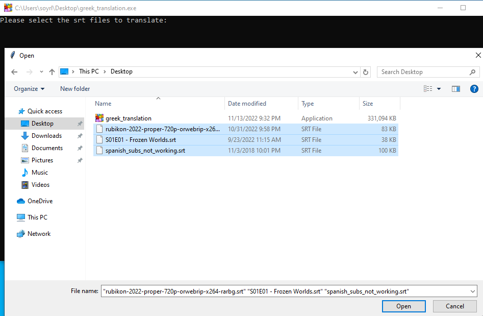

# subtitles_translation


[](https://www.python.org/)
[](https://forthebadge.com)

[]( https://github.com/nsourlos/subtitles_translation)

Translate Subtitles from any Language to Greek

Execute the **[greek_translation.exe](https://drive.google.com/file/d/1bbEn9grYSoEtc-9nPsfd25ZkkCP5q8Aq/view?usp=sharing)** file to select subtitle files, translate them from any language to Greek and save them in the same directory as the original files.

***An internet connection is required for this tool to work!***

> This tool has been tested and works on Windows 10. It probably won�t work in other operating systems (tested and does <ins>not</ins> work on Windows 7). It performs better from other free solutions like [this](https://subtitlestranslator.com/en/), or tools like [this]( https://github.com/Montvydas/translatesubs) that give many errors.


The Exe file was created using [auto-py-to-exe]( https://pypi.org/project/auto-py-to-exe/) module which utilizes [pyinstaller](https://pyinstaller.org/en/stable/index.html). More information on how to use it to create exe files can be found [here]( https://nitratine.net/blog/post/issues-when-using-auto-py-to-exe/?utm_source=auto_py_to_exe&utm_medium=readme_link&utm_campaign=auto_py_to_exe_help)


## Detail of  script used - [greek_translation.py](/greek_translation.py) 

The script initializes a [Tkinter](https://docs.python.org/3/library/tkinter.html) window that allows users to select the subtitle files to be translated. This window also prints in the terminal the following:


```bash
Please select the srt files to translate: 
```

This can be seen in the screenshot below:


The user should select the subtitles of interest, but they all have to be in `srt` format.

If a different file extension is provided the translation won�t work and the following error will be printed:

```bash
File ... not processed. Please select a valid file type (.srt, .txt, .sub)
```

Translation is performed using the library [googletrans](https://pypi.org/project/googletrans/). This library works without having to use an API key since it generates a ticket by reverse engineering on the obfuscated and minified code used by Google to generate such token, and implemented on the top of Python. However, this could be blocked at any time. This tool gives free and unlimited Google Translate API requests to translate the subtitles.

A list that contains all the text in each timestep can be given as input to the above library, but it will take much time to translate it (~1min) since in that case [googletrans](https://pypi.org/project/googletrans/) does multiple translations in one session, not in one request, and so, it has to send multiple requests for translation and the speed can�t be [improved](https://github.com/ssut/py-googletrans/issues/74). 

To change that text is provided as input to that library as string. The limitation of this approach is that for every request there is a limit of [15k](https://py-googletrans.readthedocs.io/en/latest/) characters (13.6 in practice). Therefore, it was preferred to split the text in many chunks, send each chunk separately for translation, and combine the all the translated chunks at the end to produce the final translation.

The final translations is produced in the same folder as the original ones with the same names plus `_output.srt` at the end. 

It might be difficult to have a good translation when a sentence extends in more than 2 timesteps since [googletrans](https://pypi.org/project/googletrans/) can�t capture these long range dependencies, especially if the original subtitle consists of many newline characters and of many `...` between timesteps.


## Contributing
Pull requests are welcome. For major changes, please open an issue first to discuss what you would like to change.