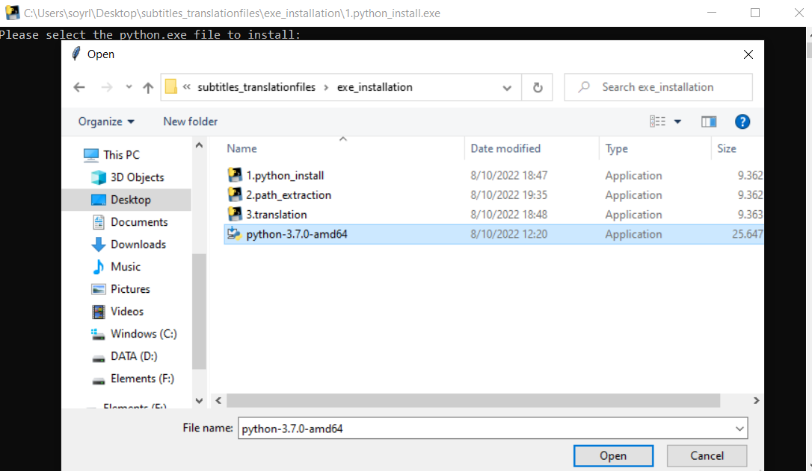
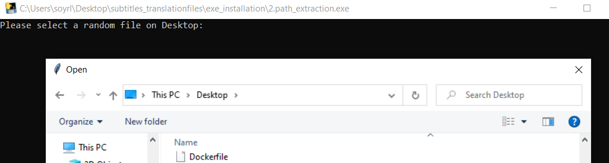
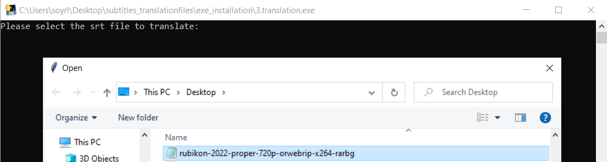

# subtitles_translation


[](https://www.python.org/)
[](https://forthebadge.com)

[](https://opensource.org/licenses/MIT)
[]( https://github.com/nsourlos/subtitles_translation)


Translate Subtitles from any Language to Greek

Execute an exe file to select and translate subtitles from any language to Greek. 

> This tool has been tested and works on Windows 10. It probably won’t work in other operating systems (tested and does <ins>not</ins> work on Windows 7).

Exe files were created using [auto-py-to-exe]( https://pypi.org/project/auto-py-to-exe/) module which utilizes [pyinstaller](https://pyinstaller.org/en/stable/index.html).

There are 3 executable files (based on scripts) in this project:
 - [one](/exe_installation/1.python_install.py) to install python, 
 - [one](/exe_installation/2.path_extraction.py) to install the library [translatesubs](https://pypi.org/project/translatesubs/), which only be executed through the command line and this is why python is needed - as well as to find and print the path that needs to be added in the environmental variables (details below),
 - [one](/exe_installation/3./translation.py) to select the subtitles file, translate it to Greek and save the translated subtitles file

The first two files should only be executed the first time that we try to translate subtitles in a specific computer. After that, only the third script/exe file should be used to translate subtitles.

## Details of  files 

- [python_install](#python_install)
- [path_extraction](#path_extraction)
- [translation](#translation)


### [python_install](/1.python_install.py)

This file is used to install python version 3.7. The exe file **[python-3.7.0-amd64](/exe_installation/python-3.7.0-amd64.exe)** should be selected when this script/exe file is executed. The script initializes a [Tkinter](https://docs.python.org/3/library/tkinter.html) window that allows users to select the python executable mentioned above, to be installed automatically using the [subprocess](https://docs.python.org/3/library/subprocess.html) library. Python is needed since the [translatesubs](https://pypi.org/project/translatesubs/) library can only be installed and used with [pip](https://pypi.org/project/pip/), which requires python installation. 

The exe file for this script shows the [Tkinter](https://docs.python.org/3/library/tkinter.html) window along with a print in the terminal that asks the user:

```bash
Please select the python.exe file to install:
```

The user should select the file **[python-3.7.0-amd64](/exe_installation/python-3.7.0-amd64.exe)** and the installation will be done automatically. After that, the window and the terminal will shut down.

<!--  -->



### [path_extraction](/2.path_extraction.py) 

This file is used to install the [translatesubs](https://pypi.org/project/translatesubs/) library that translates the subtitles. It also prints the path which should be manually added by the user in the [Environmental variables](https://helpdeskgeek.com/windows-10/add-windows-path-environment-variable/) path. The latter is needed so that [pip](https://pypi.org/project/pip/) can see the installed libraries.

[Translatesubs](https://pypi.org/project/translatesubs/) library is used since it performs really well when sentences extend in more than one timeslot of a subtitle (more than one line on the screen for the same sentence). It uses [googletrans](https://pypi.org/project/googletrans/) library which allows free and unlimited Google Translate API requests to translate the subtitles. 

The exe file just asks the user to select a file in the Desktop so that it can extract the right path which should be added in the [Environmental variables](https://helpdeskgeek.com/windows-10/add-windows-path-environment-variable/) and it prints it to the user in the command line tool. When the user copies and pastes that path it can exit by clicking **Enter** in the terminal window.


 
### [translation](/3.translation.py) 

This is where the translation happens. This file should be used everytime we want to translate a specific srt file. The tool first tries to translate the subtitles using the [Translatesubs](https://pypi.org/project/translatesubs/) library. If this fails then it tries again by using some separators (more information on that in the documentation of the library). If this also fails then it uses a line by line translation with [googletrans](https://pypi.org/project/googletrans/) which is suboptimal since information about the exact translation might be contained in the next sentence and therefore, is not captured.

At the end, it removes all the non-Greek characters since the above library keeps them both in the final subtitles. 

The exe file prompts the user to select the srt file to translate and it returns the translated srt file in Greek, and in the same directory where this exe file/script is located, named as `Output.srt`. 



## Contributing
Pull requests are welcome. For major changes, please open an issue first to discuss what you would like to change.

 
## License
[MIT License](LICENSE)


